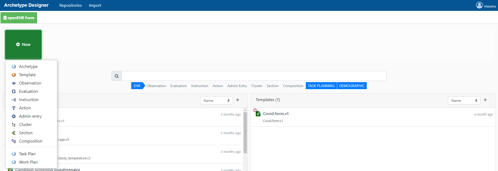

# The Medblocks Stack

Medblocks is an opinionated way to build and ship modern health care applications. It leverages Health IT standards as well as best practices in software development to create reusable applications. We build and leverage open-source technology to make it possible for anyone to build 

### Why?

Let's say you want to build a telemedicine application for hospitals. You start off by using a database like MongoDB and your language of choice and start working on things like video conferencing and booking appointments - things essential to your app. You finally launch your app, and hospitals start using it! 🎉

Over time, you realize that your users ask for more - "Can you add the ability to record the patient's condition?", "What about payments and accounting?". Before you know it, your "telemedicine application" now supports the entire workflow of the entire hospital. Since time and resources are limited, these "add-on" features will be an afterthought. The result - **frustrated **practitioners and **overworked **you.

<mark style="color:blue;">**Problem 1**</mark><mark style="color:blue;">: Scope creep is very common in healthcare. One app cannot do it all.</mark>

A year goes by, and the hospital using your app is now interested in the data you've been collecting about the patients - some medical students are interested in conducting research. So you give them a dump of your MongoDB database and you go about your work. Only to receive a dozen phone calls asking you "What do you mean by this field _bp\_snn4_ and _bpk1_?", "What are these codes used in the diagnosis field?" and "Why is the pulse rate captured as a hexadecimal color?".

Most of them revolve around "How do I make sense of this data?".

> Data ages like fine wine, software ages like fish.

And imagine after 10 years of using your application, the hospital decides they want to move to other applications. They want to use a new application that offers better management of the doctor's workflow, and there's another application that offers excellent video conferencing. You are now tasked with collaborating with these developers and migrating the data from your systems into these two systems with different data schemas! The result is a lot of data loss and countless days of mapping and remapping.

<mark style="color:blue;">**Problem 2**</mark><mark style="color:blue;">: Capturing standardized data in healthcare is hard.</mark>

There are standards for capturing healthcare data in a standardized way like openEHR, and FHIR. And there are standardized ways of coding data like SNOMED CT, LOINC, RxNorm, ICD, and more.

However, asking a developer to use Health IT standards correctly in an application is a lot more work than "just building the app". And making an application standard-compliant just for the sake of standards leads to a poor experience for everyone involved.

### The solution

It's always going to be harder to build applications that comply with standards.

However, by leveraging on standards, and by separating your application from the data you can do something magical ✨. Your application can now **just do one thing really well**, and let the other apps handle all the other requirements.

We try to make it easier to build and ship applications that comply with standards by using and building open-source technology.

Here is a guide on how to get started:


[Broken link](broken-reference)


> With Loom, you can record your camera, microphone, and desktop simultaneously. Your video is then instantly available to share through Loom's patented technology.
>
> — From the [Loom Docs](https://support.loom.com/hc/en-us/articles/360002158057-What-is-Loom-)

> The Mailchimp Marketing API provides programmatic access to Mailchimp data and functionality, allowing developers to build custom features to do things like sync email activity and campaign analytics with their database, manage audiences and campaigns, and more.
>
> — From the [Mailchimp Marketing API docs](https://mailchimp.com/developer/marketing/docs/fundamentals/)

## Getting Started

**Got 2 minutes?** Check out a video overview of our product:




**Good to know:** A succinct video overview is a great way to introduce folks to your product. Embed a Loom, Vimeo or YouTube video and you're good to go! We love this video from the fine folks at [Loom](https://loom.com) as a perfect example of a succinct feature overview.


### Guides: Jump right in

Follow our handy guides to get started on the basics as quickly as possible:


[creating-your-first-project.md](guides/creating-your-first-project.md)



[creating-your-first-task.md](guides/creating-your-first-task.md)



[advanced-permissions.md](guides/advanced-permissions.md)



**Good to know:** your product docs aren't just a reference of all your features! use them to encourage folks to perform certain actions and discover the value in your product.


### Fundamentals: Dive a little deeper

Learn the fundamentals of MyProduct to get a deeper understanding of our main features:


[projects.md](fundamentals/projects.md)



[members.md](fundamentals/members.md)



[task-lists.md](fundamentals/task-lists.md)



[tasks.md](fundamentals/tasks.md)



**Good to know:** Splitting your product into fundamental concepts, objects, or areas can be a great way to let readers deep dive into the concepts that matter most to them. Combine guides with this approach to 'fundamentals' and you're well on your way to great documentation!

