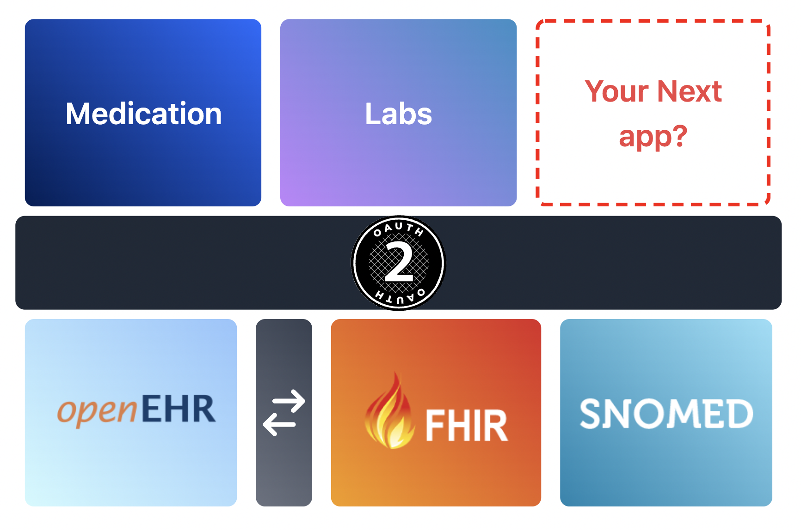

# Clinical Forms with openEHR

Create a folder with the name "templates" in base directory of your app and paste your exported template (JSON) in that folder**Good to know:** your product docs aren't just a reference of all your features! use them to encourage folks to perform certain actions and discover the value in your product.

### Download archetypes needed for the form from Clinical Knowledge Manager (CKM)

Archetypes needed for your system can be scoped out from openEHR's Clinical Knowledge Manager website and downloaded. Download the Archetype files in ADL format and make sure to include at least one Root Archetype.

[Clinical Knowledge Manager](https://ckm.openehr.org/ckm)

 (1).png>)

### Create a new repository in Archetype Designer

Archetype Designer is a tool provided by Better to create templates and archetypes. If you cannot find an archetype specific to your needs, you can create one on Archetype Designer.

[Archetype Designer](https://tools.openehr.org/designer/#/)

 (1).png>)


### Import all the archetypes downloaded to the repository

Open the newly created Repository, click the import button and select all the archetypes downloaded and click Upload All to upload the archetypes

.png>)

### Create a new template

Select 'New' and 'Template' to create a new template. You will have to select an RM Type and a Root Archetype id and give an id for the template.



.png>)

### Add the imported archetypes as required to the template

After following the above steps a blank template will be created. Add your imported archetypes by pressing the "+"(add) button on "content". Customise your template according to the requirements, you can deselect attributes of archetypes that are unnecessary.

.png>)

### Export the Template

After you are done editing your template, click export and select "Web Template" while exporting. This will export your template in a JSON format which will be used to create Clinical forms.

* (Export the template in OPT format also, you will need to post this file to openEHR server for posting compositions)

.png>)

### Install Medblocks UI VsCode Extension

Open VsCode and navigate to the tab (Ctrl + Shift + X). Search for Medblocks-UI and install the Medblocks UI VsCode Extension.

[https://marketplace.visualstudio.com/items?itemName=tornadoalert.medblocks-ui](https://marketplace.visualstudio.com/items?itemName=tornadoalert.medblocks-ui)

.png>)

### Install Medblocks-UI npm package and import it into your app

Use the npm install command given below to install Medblocks-ui in your app

```
npm i medblocks-ui
```

Use the code snippet given below to import the packages in your app

```
import "medblocks-ui";
import "medblocks-ui/dist/shoelace";
```

### Import template in your app

Create a folder with the name "templates" in the base directory of your app and paste your exported template (JSON) into that folder

.png>)

### Use Medblocks Extension to generate JavaScript code for a Clinical form

Navigate to the Medblocks Extension Tab in VsCode, it will automatically detect the template and generate a JavaScipt code for a Clinical Form from your template.

.png>)

### Using the extension to create forms

Click the clipboard icon to copy all the code generated and paste it into your app

.png>)

### Make it look better

The code generated will contain limited CSS, so use TailwindCSS, Bootstrap, Shoelace Style or any other CSS framework to make your form look better.

.png>)

### Congratulations, You are Done !!

### You can now post start posting compositions to your openEHR server !!

_PS: Don't forget to post the template to the openEHR server before posting compositions_
