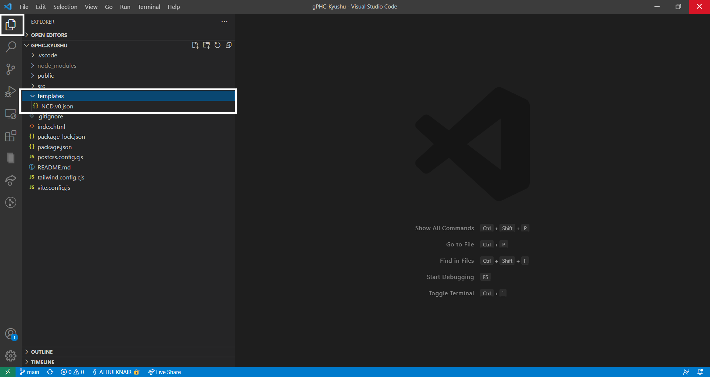
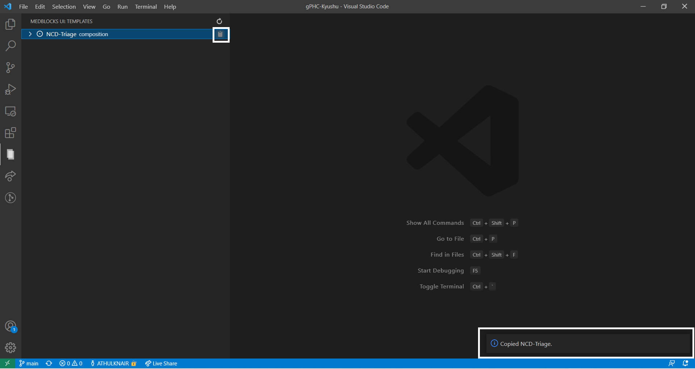
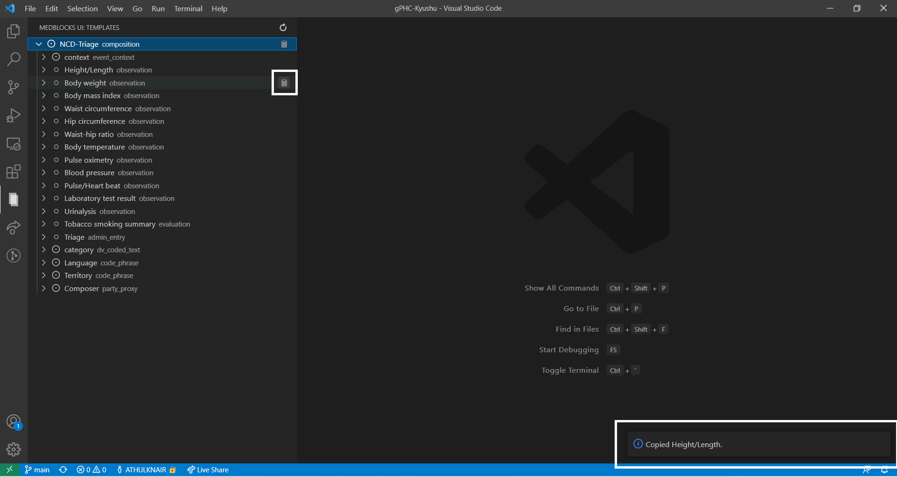
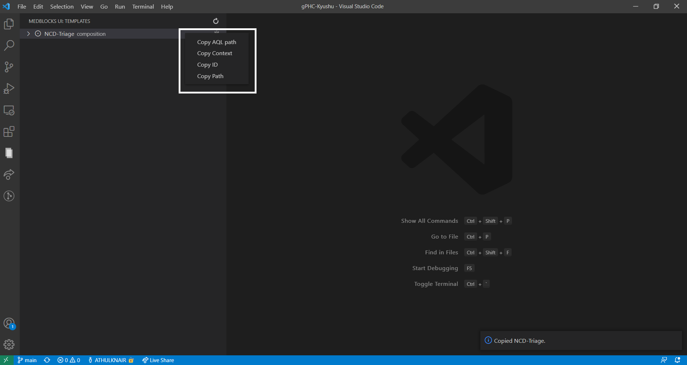
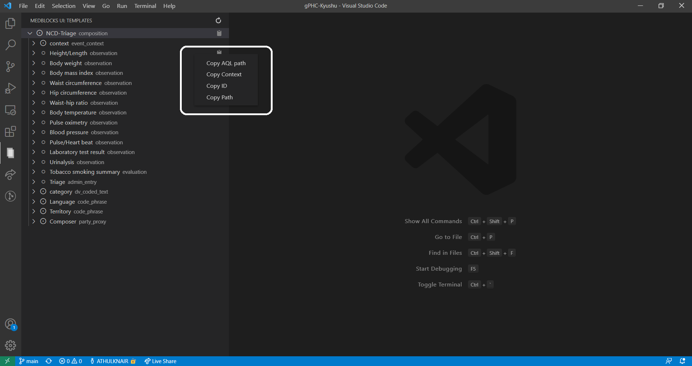
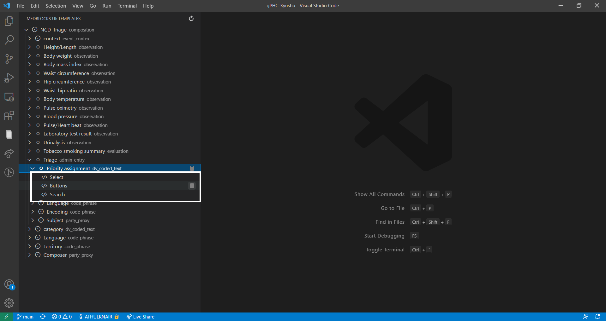

# VSCode Extension

.png>)

Medblocks UI VsCode Extension is an inevitable part of our product. This extension is to help develop fast development of openEHR templates. It renders the web templates in a tree format, where you are able to copy the snippets individually, with various options to select from. You can also render the whole template. You are also able to copy AQL paths, generate Regex patterns for data elements in openEHR archetypes and templates from the extension.

## Setup

Install the [**Meblocks UI Extension**](https://marketplace.visualstudio.com/items?itemName=tornadoalert.medblocks-ui) from the Extensions tab in VsCode.

In order to render trees in the extension, you should have web templates in `.json` format inside the '**templates**' folder in your root directory. These can be obtained directly from the [Archetype Designer](https://tools.openehr.org/designer/#/) or from EHRBase's GET `/ehrbase/rest/ecis/v1/template/<templateId>` endpoint.

Once you have the web template JSON inside the templates folder, your tree will be ready in the extension. (You can refresh the tree by clicking the **refresh button**).

Now you can copy the medblocks-ui  web component for the web template from here as **snippets.**&#x20;

Here we are copying the entire tree by clicking on the copy button:

You can also select a particular element or sub-element from the tree to copy:

You are also able to copy the **Path, ID, AQL Path, Context** of snippets by **right-clicking** on the desired component.

 

&#x20;When you copied the whole template and the snippet is pasted on your project, a **double-tick** appears before the template tree name, else the snippet is not copied correctly.

You can **replace individual code snippets** with desired components that medblocks-ui provides

**Congratulations!**  That's it! **** You have mastered how to use Medblocks UI VsCode Extension.
